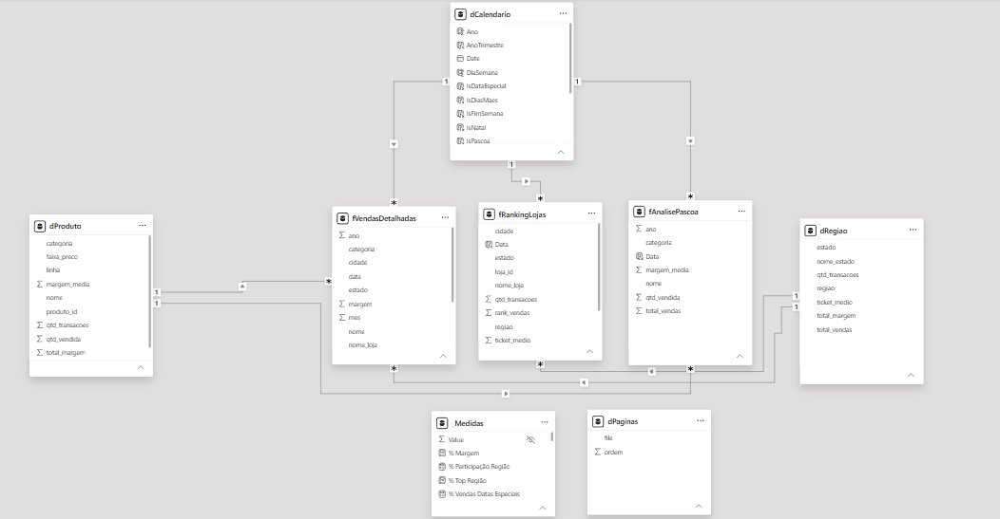
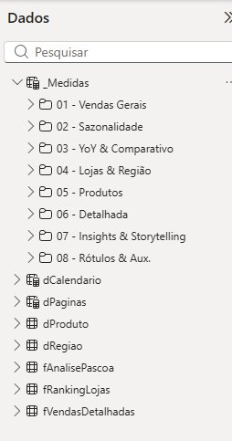

# 🍫 Cacau Show Analytics — Análise de Sazonalidade & Métricas

> Projeto de portfólio desenvolvido para simular o ambiente de dados de uma empresa de varejo de chocolates com sazonalidade extrema. Implementa **arquitetura Medallion completa** (Bronze → Silver → Gold), **modelo dimensional em estrela** e **dashboard analítico** com drill-through e storytelling dinâmico.

[](https://app.powerbi.com/groups/me/reports/70cf77c4-9bef-45a7-a635-c513bfbf87eb/8a319e4e15984d41c692?experience=power-bi)
[](https://python.org)
[](https://github.com/aledaniel022/cacaushow-analytics)

---

## 📊 Dashboard Power BI

🔗 **[Acesse o dashboard online aqui](https://app.powerbi.com/groups/me/reports/70cf77c4-9bef-45a7-a635-c513bfbf87eb/8a319e4e15984d41c692?experience=power-bi)**

---

## 🎯 Destaques do Projeto

| Métrica | Valor |
|---|---|
| 💰 Total de Vendas | R$ 381,25 Mi |
| 📈 Margem | R$ 229,98 Mi (60,3%) |
| 🧾 Transações | 133.591 |
| 🎫 Ticket Médio | R$ 2.853,83 |
| 🐣 Vendas Páscoa | R$ 136,87 Mi (35,9% do total) |
| 🎄 Vendas Natal | R$ 95,84 Mi (25,1% do total) |
| 📅 Datas Especiais | R$ 339,13 Mi (89,0% do total) |
| 🏆 Top Loja | Shopping Tijuca |
| 🗺️ Top Região | Sudeste (51,0%) |
| 🍫 Top Categoria | Trufas — R$ 152,6 Mi |

---

## 🏗️ Arquitetura — Medallion

```
Bronze (Raw)           Silver (Processed)        Gold (Aggregated)
──────────────         ──────────────────         ─────────────────
data/raw/              data/processed/            data/gold/
├── fato_vendas_raw    ├── fato_vendas.parquet    ├── gold_sazonalidade.csv
├── dim_loja_raw       ├── dim_loja.parquet       ├── gold_vendas_detalhada.csv
├── dim_produto_raw    ├── dim_produto.parquet    ├── gold_ranking_lojas.csv
├── dim_tempo_raw      ├── dim_tempo.parquet      ├── gold_analise_pascoa.csv
└── dim_vendedor_raw   ├── dim_vendedor.parquet   ├── gold_mix_produto.csv
                       └── fato_vendas.parquet    └── gold_regiao.csv
```

---

## 🌟 Modelo de Dados — Star Schema



### Tabelas Fato
| Tabela | Granularidade | Linhas |
|---|---|---|
| `fVendasDetalhadas` | Dia × Loja × Produto | 49.539 |
| `fSazonalidade` | Mês × Ano × Região | 165 |
| `fRankingLojas` | Loja acumulado | 12 |
| `fAnalisePascoa` | Produto × Ano (Páscoa) | 16 |

### Tabelas Dimensão
| Tabela | Descrição |
|---|---|
| `dCalendario` | 730 dias com flags: IsPascoa, IsNatal, IsDiasMaes, IsNamorados |
| `dRegiao` | 5 regiões, 7 estados |
| `dProduto` | 10+ SKUs em 6 categorias |

---

## 📐 Medidas DAX — 52 medidas em 8 pastas



```
_Medidas/
├── 01 - Vendas Gerais        # Total Vendas, Margem, % Margem, Ticket Médio
├── 02 - Sazonalidade         # Vendas Páscoa/Natal, Índices, Dependência Sazonal
├── 03 - YoY & Comparativo    # Var YoY %, Vendas Ano Anterior, Eixo Dinâmico
├── 04 - Lojas & Região       # Top Loja, % Participação Região, Ticket Médio Lojas
├── 05 - Produtos             # Top Produto, Top Categoria, Top Mês
├── 06 - Detalhada            # Vendas/Margem/Qtd Detalhada, Dias com Vendas
├── 07 - Insights & Storytelling  # 5 textos dinâmicos por página
└── 08 - Rótulos & Aux.       # Venda_Rotulo (top 3 meses no gráfico)
```

---

## 📱 Dashboard — 5 Páginas

| Página | Foco | Visuais |
|---|---|---|
| 🎬 Capa | Navegação interativa | Seletor de página com botão |
| 📊 Visão Executiva | KPIs gerais + tendência | Linhas 2023 vs 2024, Treemap regiões |
| 📅 Sazonalidade | Datas comemorativas | Colunas por mês, Barras por região |
| 🗺️ Região & Lojas | Performance geográfica | Matriz hierárquica, Barras horizontais |
| 🍫 Mix & Páscoa | Produtos e categorias | Barras duplas YoY, Rosca por categoria |
| 🔍 Detalhes *(oculta)* | **Drill-through** 49k transações | Tabela filtrável por região/mês/loja |

---

## 🚀 Como Executar

```bash
# 1. Clonar o repositório
git clone https://github.com/aledaniel022/cacaushow-analytics.git
cd cacaushow-analytics

# 2. Instalar dependências
pip install -r requirements.txt

# 3. Executar pipeline completo (Bronze → Silver → Gold)
python pipeline/run_all.py

# 4. Abrir o dashboard
# Arquivo: powerbi/Analise_Sazonalidade_Chocolates.pbix
```

---

## 🛠️ Stack Tecnológica

| Tecnologia | Uso |
|---|---|
| **Python 3.11+** | Pipeline ETL completo |
| **Pandas + PyArrow** | Transformações e Parquet |
| **Power BI Desktop** | Modelagem DAX e dashboard |
| **Power Query (M)** | Conexão às fontes via GitHub |
| **DAX** | 52 medidas analíticas |
| **GitHub** | Versionamento de código e dados |

---

## 📁 Estrutura do Repositório

```
cacaushow-analytics/
├── pipeline/
│   ├── 00_gerador_dados.py      # Gera dados sintéticos com sazonalidade real
│   ├── 01_transformacao.py      # Bronze → Silver (Star Schema + Parquet)
│   ├── 02_insights.py           # Silver → Gold (agregações por contexto)
│   └── run_all.py               # Executa pipeline completo
├── data/
│   ├── raw/                     # Bronze — CSVs brutos
│   ├── processed/               # Silver — Parquet tipados
│   └── gold/                    # Gold — CSVs prontos para Power BI
├── powerbi/
│   └── Analise_Sazonalidade_Chocolates.pbix
├── docs/
│   ├── img/                     # Screenshots do modelo e dashboard
│   └── modelo_dados.md
├── README.md
└── requirements.txt
```

---

## 💡 Decisões de Arquitetura

**Por que 4 tabelas fato separadas?**
Cada fato tem granularidade própria — sazonalidade mensal não pode coexistir com transações diárias sem duplicar valores. É o padrão Kimball de modelagem dimensional.

**Por que `fVendasDetalhadas` como fonte única das medidas?**
Garante que `Total Vendas` bate com a página de Detalhes — sem inconsistência entre granularidades. O total R$ 381,25 Mi é consistente em todas as páginas.

**Arquitetura Medallion no contexto corporativo:**
Em produção, Bronze/Silver seriam Delta Lake no Databricks, com Gold em tabelas Gold do Lakehouse. O padrão aqui é idêntico — só muda a camada de armazenamento.

---

## 👤 Autor

**Daniel** — Analista de Dados  
📧 Conecte-se no [LinkedIn](https://linkedin.com)  
🔗 [github.com/aledaniel022](https://github.com/aledaniel022)

---

*Projeto desenvolvido em Junho 2026 como portfólio técnico.*
